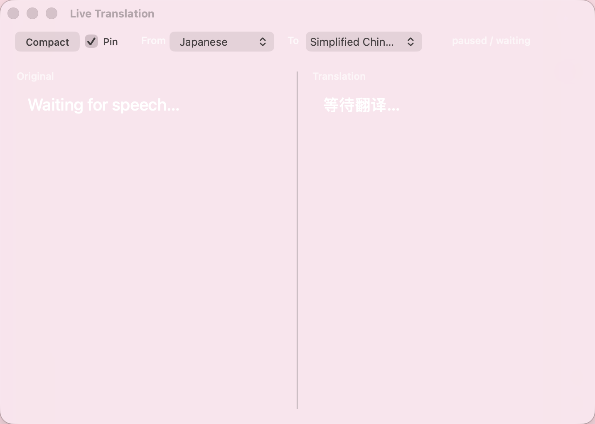

# AI直播翻译悬浮窗

适用于 Apple Silicon Mac 的开源实时双语字幕工具：捕获系统音频，在本机识别日语，再使用 OpenAI 翻译成简体中文，并在置顶悬浮窗中同时保留原文和译文。

> 本项目是通用音频辅助字幕工具，不针对任何特定网站。请遵守内容来源平台的服务条款、版权和隐私规则。

<p align="center">
  
</p>

## 功能

- BlackHole 捕获 Mac 系统音频
- MLX Whisper 在本机识别日语
- OpenAI GPT-6 Luna 翻译为简体中文
- 悬浮窗并排显示日语原文与中文译文
- 保存会话历史
- 导出 TXT、PDF、SRT、VTT
- API Key 存储在 macOS 钥匙串，不写入项目文件

## 工作流程

```text
系统音频 → BlackHole → 本机 Whisper → 日语文本 → OpenAI → 双语悬浮窗
```

音频不会上传；只有识别后的文本会发送到 OpenAI。API 请求设置了 `store: false`。

## 系统要求

- Apple Silicon Mac（M1/M2/M3/M4）
- macOS
- Homebrew
- OpenAI API Key 和可用的 API 余额

## 一键安装

```bash
git clone https://github.com/li8948552-del/ai-live-translation-overlay.git
cd ai-live-translation-overlay
chmod +x setup-m2.sh set-openai-key.sh install-app.sh
./setup-m2.sh
```

安装程序会安装 FFmpeg、Python 3.12、BlackHole 和适合当前内存的 Whisper 模型，并将 API Key 安全保存到钥匙串。

更完整的中文操作说明见 [README_DEPLOY_ZH.md](README_DEPLOY_ZH.md)。

## 配置系统音频

1. 打开“音频 MIDI 设置”。
2. 点击左下角 `+`，选择“创建多输出设备”。
3. 勾选正常使用的扬声器或耳机以及 `BlackHole 2ch`。
4. 在“系统设置 → 声音 → 输出”中选择这个多输出设备。
5. 第一次启动时允许麦克风权限。

## 启动

安装完成后打开：

```text
~/Applications/LiveTranslate.app
```

也可以从终端启动：

```bash
OPENAI_API_KEY="$(security find-generic-password -a "$USER" -s "LiveTranslate OpenAI API Key" -w)" \
  ./.venv/bin/python live_translate_overlay.py \
  --source ja --target zh --whisper medium --ollama-model gpt-6-luna
```

## 更换 API Key

```bash
./set-openai-key.sh
```

不要把 API Key 写进代码、截图、Issue 或 Git 提交。

## 项目结构

```text
live_translate_overlay.py   音频管线、命令行和 Cocoa 悬浮窗
live_translation/           文本处理、会话导出和翻译后端
LiveTranslate.app/          macOS 应用包
setup-m2.sh                 M 系列 Mac 一键安装
set-openai-key.sh           钥匙串配置
install-app.sh              应用安装脚本
tests/                      单元测试
```

## 已知限制

- 当前只支持 Apple Silicon Mac
- 必须配置 BlackHole 多输出设备
- 实时识别效果受音质、背景音乐和多人重叠说话影响
- OpenAI 翻译会产生 API 费用

## 开源许可与上游

本项目基于 [KazKozDev/live-translation](https://github.com/KazKozDev/live-translation) 修改，继续使用 MIT License，并保留原作者版权声明。感谢上游项目。
